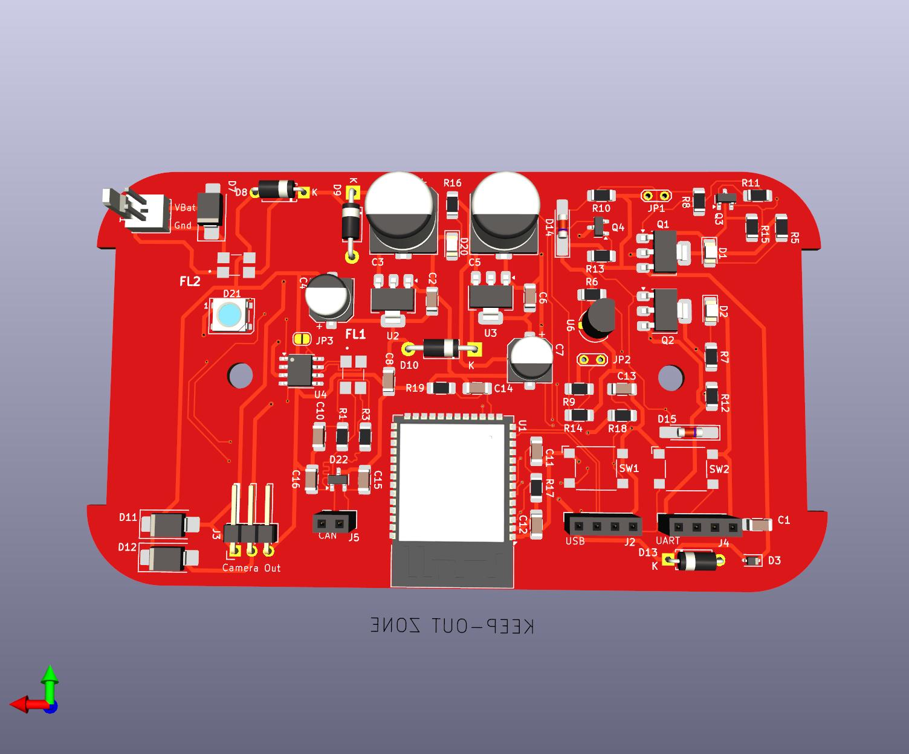
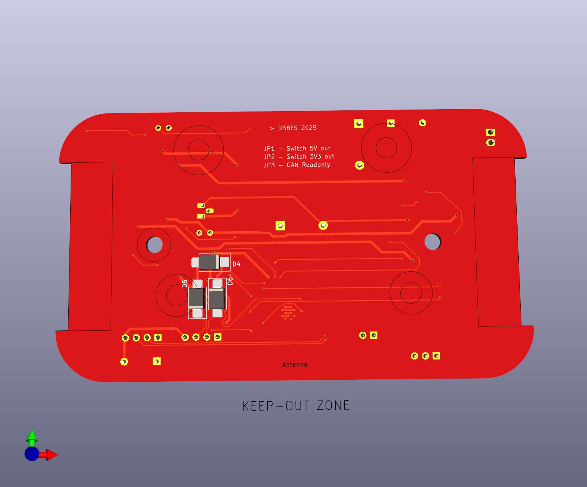

Workcross-ReverseCam
====================

ESP32-based pcb for providing ESD-safe power supply for a wireless Reverse Camera for an AODES Workcross UTV.

Schematics and PCB are designed using KiCad9.

